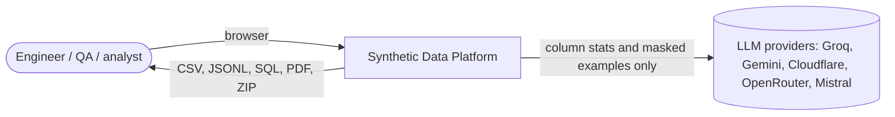
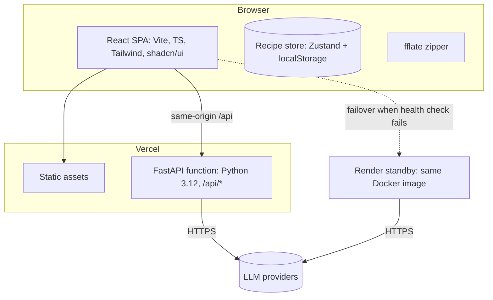
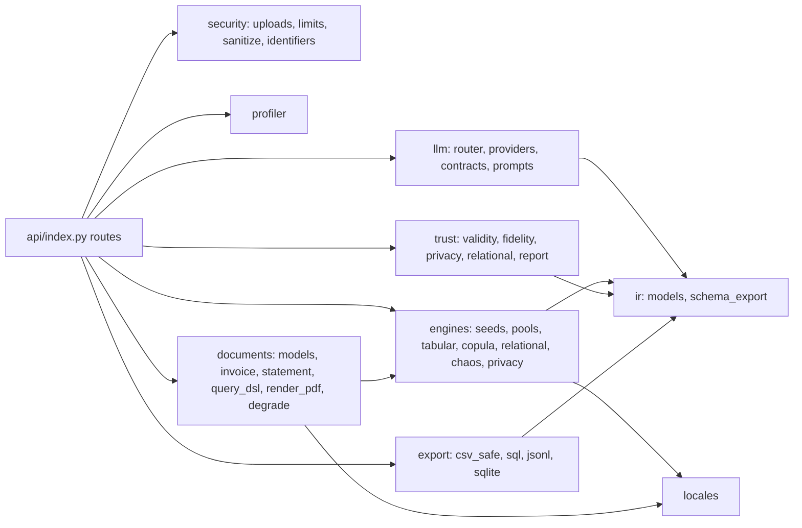
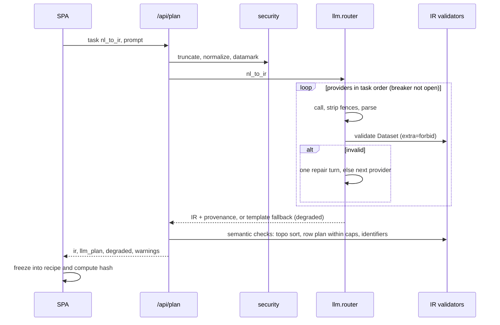
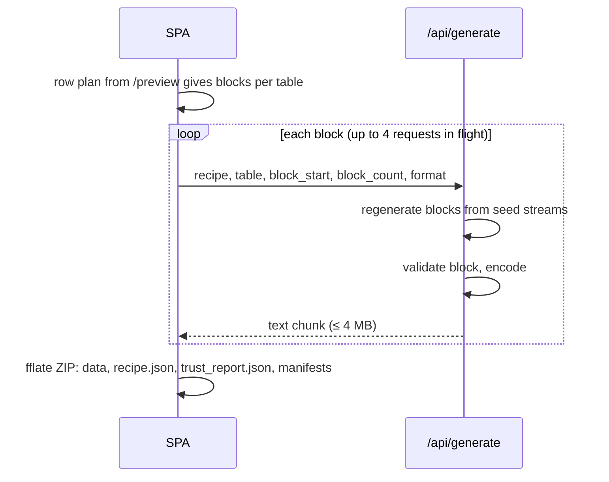

# ARCHITECTURE — HackDataV2 Synthetic Data Platform

Version 1.0 · 2026-09-29 · Format: trimmed arc42 with C4 diagrams in Mermaid
Related: [TRD](TRD.md) · [DECISIONS](DECISIONS.md) · [DESIGN](DESIGN.md)

## 1. Quality goals (priority order)
1. **Correctness** — integrity and invariants hold in every clean export (0 violations).
2. **Reproducibility** — the same recipe produces the same bytes, with or without LLMs.
3. **Safety** — no real data leaves the request, and there is no path from LLM output to any sink without an encoder.
4. **Demo reliability** — works on free tiers, through cold starts, and with every LLM provider down.
5. **Speed** — 50-row preview in ≤ 1 s; 100k rows in ≤ 30 s.

## 2. Constraints
3 people · 24 hours · free tiers only, no credit card · serverless Python within TRD §2 limits · no torch or Chromium · no server-side storage.

## 3. Context (C4 level 1)

There is no database and no other external dependency. LLM providers are optional at runtime (FR-16).

## 4. Containers (C4 level 2)

- The SPA owns state. Recipes and uploaded sample files live in the browser.
- The API is stateless. Every request carries its recipe, and every response is a pure function of its inputs (plus LLM calls on `/plan`).

## 5. Components (C4 level 3, backend)

Dependency rules, enforced by an import-linter check in CI:
- `ir` imports nothing internal.
- `llm` imports only `ir` and `security.sanitize`. Only `api` imports `llm`.
- `engines`, `documents`, `trust`, and `export` never import `llm`. LLM output reaches them only as a validated IR inside a recipe.
- `export` is the only package that writes CSV or SQL bytes.

## 6. Runtime views

### 6.1 Prompt-to-dataset (FR-10)


### 6.2 Chunked generation and export (FR-13; ADR-0009, ADR-0010)

Blocks are idempotent, so a failed request is simply retried.

### 6.3 Trust Report in sample mode (FR-12)
The SPA re-sends `{recipe, sample}`. The API validates the upload, applies the seeded 80/20 split, regenerates an evaluation subset (≤ 5k rows), and computes validity, fidelity, and privacy metrics. The sample is discarded when the response is sent.

### 6.4 Documents (FR-05 – FR-08, FR-15, FR-17)
Recipe → relational entities (customers, orders, items) → `InvoiceDoc` / `StatementDoc` (Decimal invariants, query satisfied by construction) → validators → fpdf2 render with watermark and metadata → ZIP part with `ground_truth.part.jsonl`.

## 7. Determinism model
Detailed in TRD §5 and ADR-0010:
- seed → `SeedSequence(seed, spawn_key=(table, stream, block))` → one generator per block and stream;
- Faker builds pools only;
- fixed 10k-row blocks;
- child → parent mapping by prefix sums;
- the dataset hash proves the result.

## 8. Frontend architecture
- `src/state/recipe.ts` (Zustand): current recipe, undo history, saved recipes in localStorage.
- `src/api/client.ts`: typed fetch, base-URL failover (same-origin → Render), 30 s timeout, problem+json parsing into typed errors.
- `src/types/ir.ts` is generated from `ir.schema.json`. Zod schemas in `src/schemas/` mirror it for form validation.
- Views: `StartView`, `TabularView`, `RelationalView` (React Flow ER), `DocumentsView`, `TrustDrawer`, `ExportDialog` (DESIGN §4).
- Preview requests are debounced 300 ms and cancelled on newer edits (AbortController).
- PDFs are shown in a sandboxed `<iframe>` from a blob URL. No server HTML is ever injected into the DOM.

## 9. Deployment
| Environment | What | Notes |
|---|---|---|
| Production | Vercel Hobby: static SPA + `api/index.py` (FastAPI) with an `/api/(.*)` rewrite | Keys in Vercel env |
| Standby | Render free web service from the same Dockerfile | Pinged every 10 min during judging; CORS allow-list = production origin |
| Local | `docker compose up`, optionally `OFFLINE_MODE=1` | Laptop fallback on stage |
| Backup | Recorded 4-minute demo video | Last resort |

Server-side secrets: `GROQ_API_KEY`, `GEMINI_API_KEY`, `CF_ACCOUNT_ID`, `CF_API_TOKEN`, `OPENROUTER_API_KEY`, `MISTRAL_API_KEY`, `HMAC_KEY`.

## 10. Security architecture (defense in depth)
The layers, in order:
1. Upload validation (size, type, encoding, depth).
2. A profiler-only view of the data.
3. Spotlit, datamarked prompts.
4. Strict Pydantic validation.
5. Allow-lists and output encoders.
6. Hard limits and rate limits.
7. The privacy filter.
8. The watermark and fictional entities.

Stance: assume an injection will sometimes succeed, and design so a success is harmless. The worst outcome is a wrong-but-valid plan that the user sees and can edit.

## 11. Cross-cutting concerns
- **Config**: `synth/config.py` (pydantic-settings) reads env: `OFFLINE_MODE`, `ENGINE_VERSION`, limits, keys.
- **Errors**: problem+json everywhere. The SPA maps each `code` to microcopy (DESIGN §7).
- **Logging**: JSON logs with request ID, route, duration, status, and degraded flag. Never bodies, samples, prompts, or headers.
- **Versioning**: `engine_version` (semver) changes whenever output bytes can change. Recipes record it.

## 12. Repository layout
```
.
├── AGENTS.md  CLAUDE.md  README.md
├── docs/            PRD  TRD  ARCHITECTURE  DESIGN  DECISIONS  ROADMAP  PROGRESS
├── api/index.py     FastAPI app (Vercel entry)
├── synth/
│   ├── config.py
│   ├── ir/          models.py  schema_export.py  ir.schema.json
│   ├── profiler/    profile.py  redact.py  pii.py
│   ├── llm/         router.py  providers.py  providers.yaml  contracts.py  prompts/
│   ├── engines/     seeds.py  pools.py  tabular.py  copula.py  relational.py  chaos.py  privacy.py
│   ├── documents/   models.py  invoice.py  statement.py  query_dsl.py  render_pdf.py  degrade.py  templates/
│   ├── locales/     en_US.yaml  en_IN.yaml  de_DE.yaml
│   ├── trust/       validity.py  fidelity.py  privacy.py  relational.py  report.py
│   ├── export/      csv_safe.py  sql.py  jsonl.py  sqlite.py
│   └── security/    uploads.py  sanitize.py  identifiers.py  limits.py
├── src/             views/  components/  state/  api/  schemas/  types/
├── tests/           unit/  golden/  parity/  redteam/  fixtures/
├── scripts/         bundle_size.sh  gen_types.sh  warm_demo.sh
└── vercel.json  Dockerfile  docker-compose.yml  requirements.txt  requirements-dev.txt  package.json
```

## 13. Risks
| Risk | Mitigation |
|---|---|
| Bundle over 500 MB | Measure in H0. Remove pandas first; then replace SciPy/scikit-learn calls with NumPy implementations |
| Cold start on stage | Ping `/api/health` 2 minutes before; standby kept warm |
| Free LLM quota burned | Pre-warmed demo recipes (cached plans); offline mode |
| Rate-limit and breaker state is per serverless instance | Accepted; safety rests on stateless per-request caps (ADR-0011) |
| Scope creep in documents | H12 cut list (ROADMAP) |
